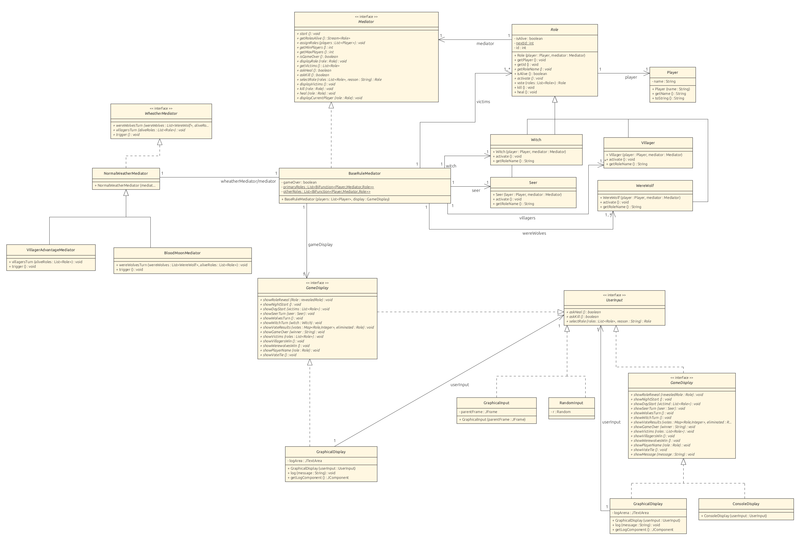

# Loups-garous - Mediator

## Introduction

Durant ce projet, nous avons implémenté le jeu des Loups-garous de Thiercelieux en Java, en utilisant le pattern de
conception [Mediator](https://refactoring.guru/design-patterns/mediator). Ce pattern permet de centraliser la
communication entre les différents objets du jeu (joueurs, roles, ui…), facilitant ainsi la gestion des interactions
et des règles du jeu.

Aussi, nous avons ajouté au jeu une fonctionnalité particulière, des changements aléatoires du médiateur gérant la
partie. Celà nous permet de changer les règles du jeu en cours de partie, rendant le jeu plus dynamique. Ce changement à
chaud est réalisé grâce au Strategy Pattern.

## Conception

### Mediator

Les classes et interfaces suivantes sont utilisées pour implémenter le pattern Mediator :

- **Mediator** : Interface définissant les méthodes de communication entre les différents composants du jeu. (Sauf la
  gestion des tours des loups-garous et des villageois). ... (à compléter)
- **BaseRuleMediator** : Sous-classe de Mediator, implémente les règles de base du jeu.
- **WeatherMediator** : Interface ... (à compléter)
- **NormalWeatherMediator** : ... (à compléter)
- **BloodMoonMediator** : ... (à compléter)
- **VillagerAdvantageMediator** : ... (à compléter)

### Roles

Classe abstraite `Role` représentant un rôle dans le jeu. Elle est responsable de la gestion des actions spécifiques à
chaque rôle. Contient un lien sur le mediator avec lequel elle interagit pour effectuer des actions. Contient aussi un
champ `isAlive` pour savoir si le joueur est encore en vie.

Rôles implémentés :

- **Loup-garou** : Peuvent voter afin de choisir un joueur à éliminer pendant la nuit.
- **Villageois** : Ne possède pas de pouvoir spécial, mais participe aux discussions durant le jour et peut voter pour
  éliminer un joueur.
- **Voyante** : Peut découvrir le rôle d'un joueur pendant la nuit.
- **Sorcière** : Possède deux potions, une pour sauver un joueur et une pour tuer un joueur, qu'elle peut utiliser
  pendant la nuit.

## Diagramme de classe

## Instructions de déploiement et lancement

### Prérequis

- Java

### Installation

### Lancement

